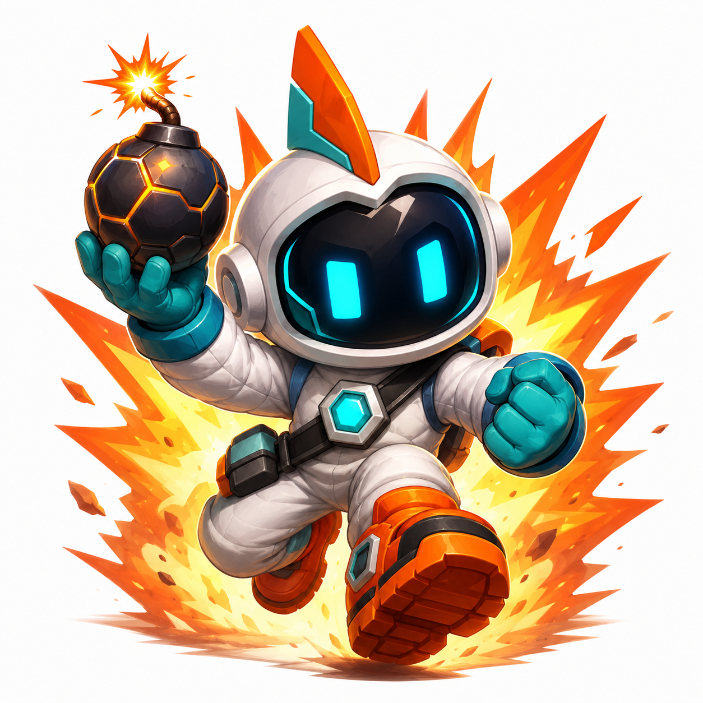

Terminalで遊ぶボンバーマン。操作感は本家に寄せつつ、見た目・SE・BGMはすべてオリジナル素材(本家の画像・音源は一切使用しない)。



## ビルド・実行

```sh
cargo build --release
cargo run --release
```

## 4人対戦（ネットワーク）

ホストが1人サーバーを兼ね、残りが参加する方式。ゲームの進行はホストだけが計算し、参加者は入力を送って結果を受け取る。

引数なしで起動すると、イントロのあとゲーム内のメニューで「1人プレイ」「ホストになる」「参加する」を選べる(ホストは対戦人数、参加者は接続先アドレスもその場で入力する)。

```sh
cargo run --release
```

コマンドライン引数でも直接起動できる(こちらはメニューを介さない近道):

```sh
# ホスト(自分もプレイする)。--players は2〜4人(既定3)
cargo run --release -- host --port 4321 --players 3

# 参加する側。アドレスは host:port
cargo run --release -- join 192.168.1.10:4321
```

(`cargo install --path .` 済みなら `bombermanterm host ...` / `bombermanterm join ...` とそのまま呼べる)

参加者が揃うとホストの画面に開始の案内が出るので、ホストが Space を押すと対戦が始まる。対戦ではCPU敵は出ず、最後に残った1人が勝ち(相打ちは引き分け)。

## 操作

| キー | 動作 |
|---|---|
| ↑ ↓ ← → / h j k l | 移動 |
| Space | ボム設置 / リザルト画面でタイトルへ戻る |
| Esc / q | 終了 |

## ゲームシステム

- 1人プレイ + CPU敵3体(徘徊/追尾/回避の3タイプ)
- ボムは設置後しばらくして爆発。爆風は破壊可能ブロックで止まり、他のボムを巻き込むと連鎖爆発する
- 破壊可能ブロックからは確率でアイテムが出現する: 火力アップ / ボム設置数アップ / 移動速度アップ / 無敵モード
- 敵を全滅させればステージクリア、残機が尽きればゲームオーバー

## 音

BGM・SEは矩形波/三角波/ノイズ合成によるオリジナルのチップチューン。wav等のファイル同梱は無く、実行時にオンザフライで生成している。

## 開発

- Rust + [ratatui](https://github.com/ratatui/ratatui)(描画) + [rodio](https://github.com/RustAudio/rodio)(音声)
- 仕様は [SPEC.md](./SPEC.md) を参照

```sh
cargo test
```
